# Diabetes Risk Prediction System
## Deteksi Dini Risiko Diabetes Berbasis Gaya Hidup Menggunakan Machine Learning

[](https://python.org)
[](https://scikit-learn.org)
[](https://flask.palletsprojects.com)

---

## Overview
Proyek ini membangun sistem prediksi risiko diabetes berbasis Machine Learning menggunakan dataset CDC Behavioral Risk Factor Surveillance System (BRFSS) 2014. Model Random Forest Classifier dioptimalkan melalui Hyperparameter Tuning dan Cross Validation, kemudian di-deploy sebagai aplikasi web interaktif menggunakan Flask.

Proyek ini dikerjakan dalam rangka **Magang Mandiri Batch 4 (MSIB) di PT Vinix Seven Aurum**, Divisi Python Machine Learning.

---

## Dataset
| Item | Detail |
|---|---|
| Dataset | CDC Diabetes Health Indicators (BRFSS 2014) |
| Source | UCI Machine Learning Repository |
| Original Records | 253.680 |
| After Cleaning | 229.474 |
| Class Distribution | 85% No Diabetes / 15% Diabetes |
| Target Variable | Diabetes_binary (0 = No Diabetes, 1 = Diabetes) |

---

## Project Structure
```
diabetes_prediction_system/
├── notebook/
│   ├── diabetes_prediction.ipynb
│   └── outputs/
│       ├── 01_distribusi_target.png
│       ├── 02_correlation_heatmap.png
│       ├── 03_mutual_information.png
│       ├── 04_metrik_base_model.png
│       ├── 05_confusion_matrix_base.png
│       ├── 06_roc_curve_base.png
│       ├── 07_feature_importance_rf.png
│       ├── 08_feature_importance_lr.png
│       ├── 09_confusion_matrix_tuned.png
│       ├── 10_roc_curve_tuned.png
│       ├── 11_perbandingan_base_optimized.png
│       └── diabetes_rf_model.pkl
├── flask/
│   ├── app.py
│   ├── diabetes_rf_model.pkl
│   ├── config.json
│   ├── requirements.txt
│   ├── index.html
│   ├── styles.css
│   └── script.js
└── README.md
```

## Project Workflow

### 1. Data Inspection & EDA

#### Distribusi Target
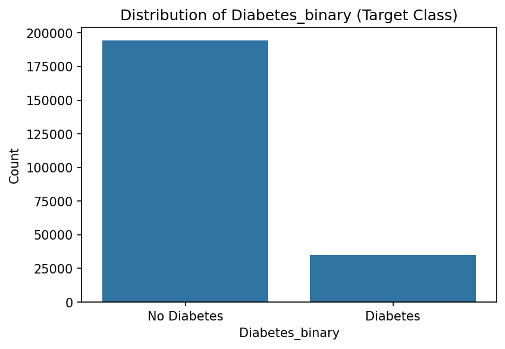

Dataset menunjukkan ketidakseimbangan kelas yang signifikan: **86% No Diabetes** vs **14% Diabetes**.

#### Correlation Heatmap
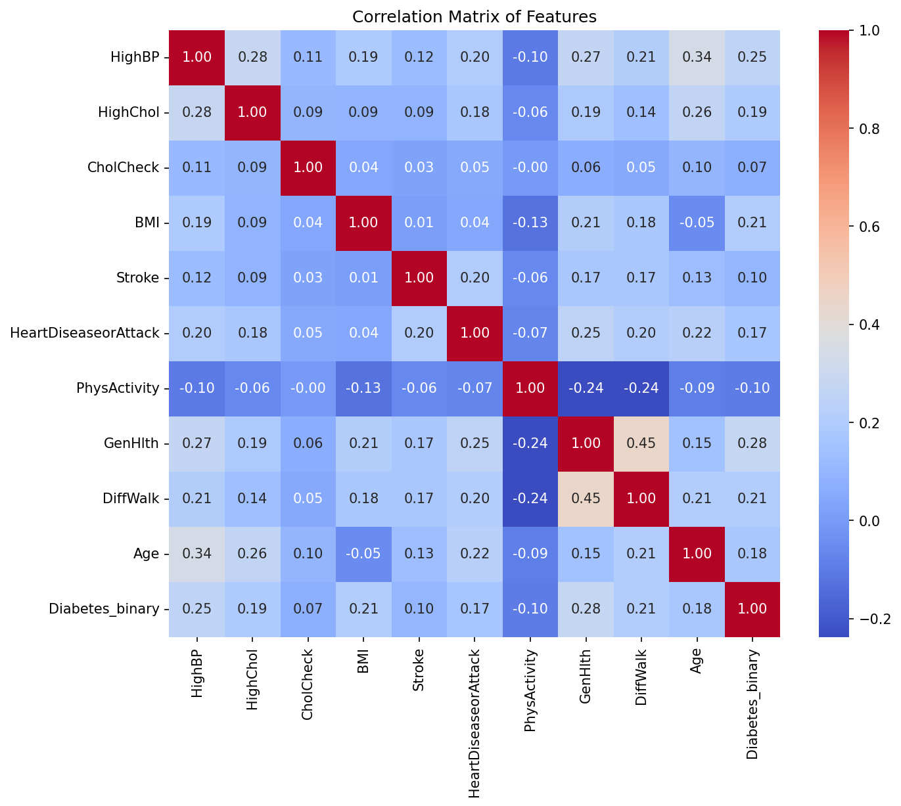

Variabel GenHlth, HighBP, BMI, DiffWalk, dan HighChol menunjukkan korelasi tertinggi dengan target Diabetes_binary.

#### Mutual Information
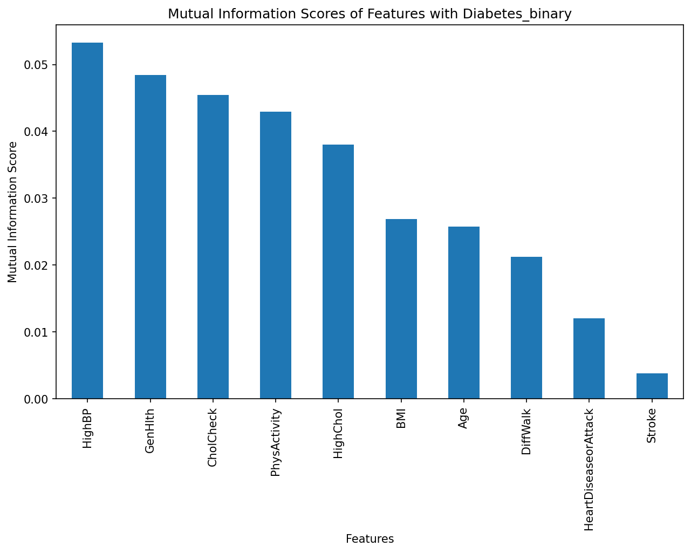


### 2. Feature Selection
Dari 21 fitur awal, dipilih **10 fitur** berdasarkan Correlation Analysis, Mutual Information, dan Stacked Bar Chart:

| No | Feature | Description |
|---|---|---|
| 1 | HighBP | Tekanan darah tinggi (0/1) |
| 2 | HighChol | Kolesterol tinggi (0/1) |
| 3 | CholCheck | Pemeriksaan kolesterol 5 tahun terakhir (0/1) |
| 4 | BMI | Indeks Massa Tubuh |
| 5 | Stroke | Riwayat stroke (0/1) |
| 6 | HeartDiseaseorAttack | Riwayat penyakit jantung (0/1) |
| 7 | PhysActivity | Aktivitas fisik rutin (0/1) |
| 8 | GenHlth | Kondisi kesehatan umum (1-5) |
| 9 | DiffWalk | Kesulitan berjalan (0/1) |
| 10 | Age | Kategori usia (1-13) |

---

### 3. Base Model Comparison

#### Perbandingan Metrik Base Model
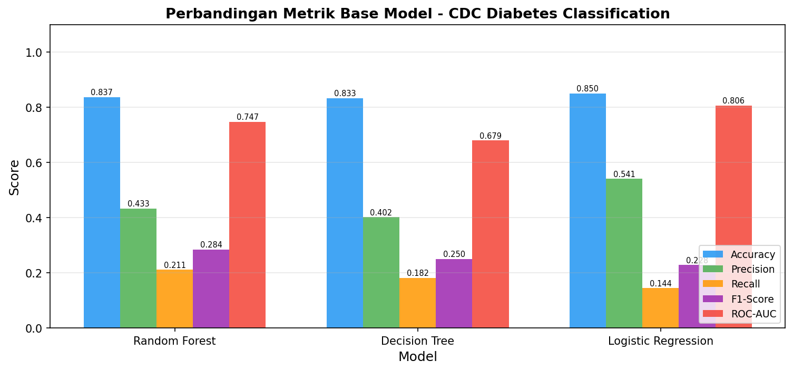

| Model | Accuracy | Precision | Recall | F1-Score | ROC-AUC |
|---|---|---|---|---|---|
| Random Forest | 0.8371 | 0.4330 | 0.2111 | 0.2839 | 0.7466 |
| Decision Tree | 0.8334 | 0.4016 | 0.1816 | 0.2501 | 0.6793 |
| Logistic Regression | 0.8504 | 0.5406 | 0.1443 | 0.2278 | 0.8059 |

> **Random Forest** dipilih untuk dioptimalkan karena memiliki Recall tertinggi (0.2111) dan ROC-AUC kompetitif (0.7466) sebagai ensemble method dengan ruang optimasi yang lebih besar.

#### Confusion Matrix Base Model
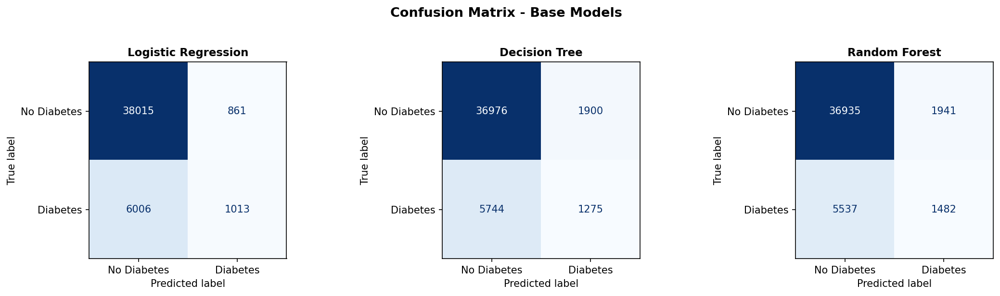

#### ROC Curve Base Model
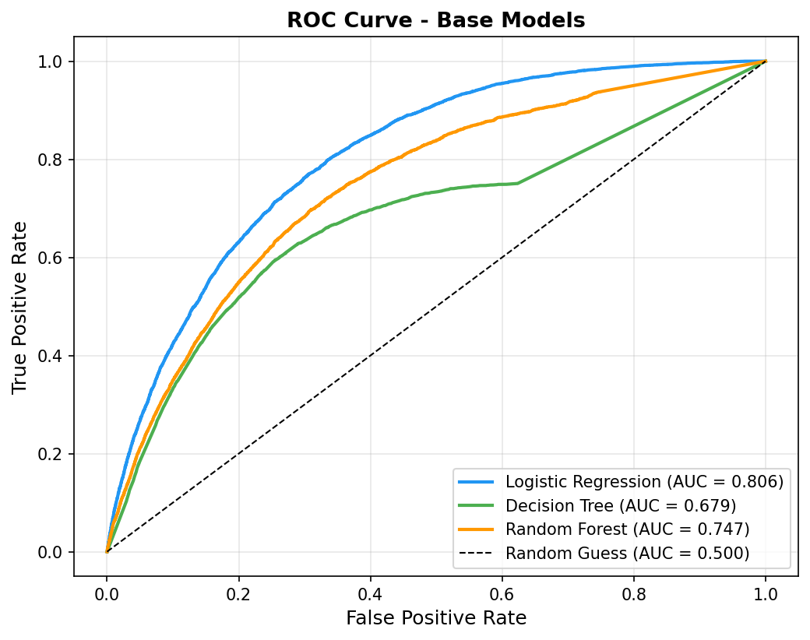

---

### 4. Feature Importance

#### Random Forest Feature Importance
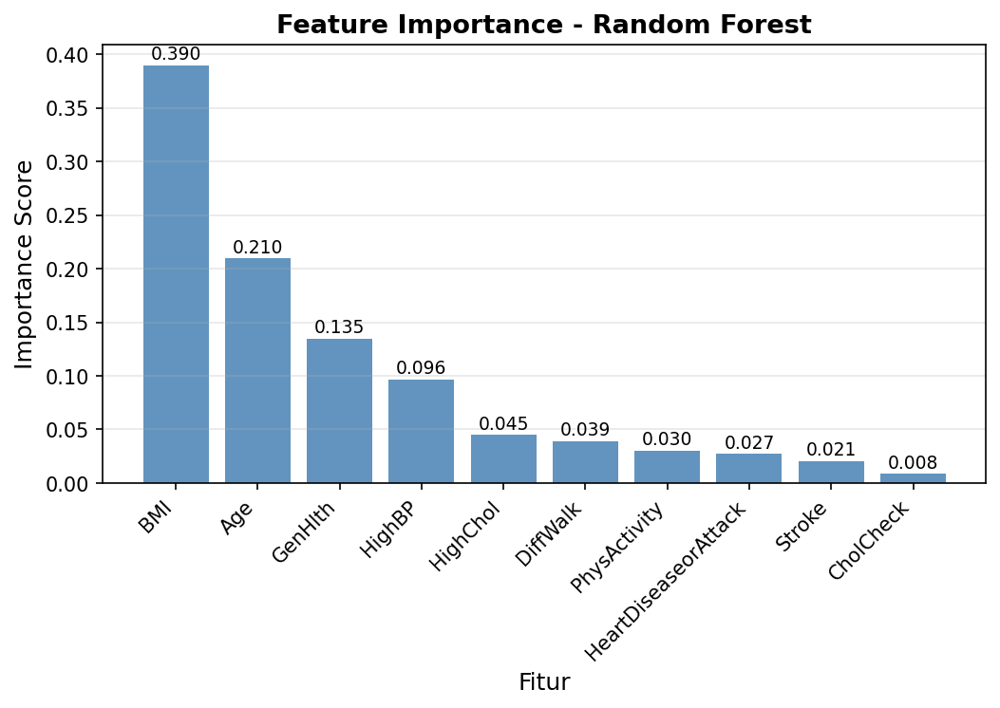

| Rank | Feature | Importance |
|---|---|---|
| 1 | BMI | 0.3899 |
| 2 | Age | 0.2096 |
| 3 | GenHlth | 0.1345 |
| 4 | HighBP | 0.0964 |
| 5 | HighChol | 0.0448 |
| 6 | DiffWalk | 0.0390 |
| 7 | PhysActivity | 0.0300 |
| 8 | HeartDiseaseorAttack | 0.0270 |
| 9 | Stroke | 0.0206 |
| 10 | CholCheck | 0.0083 |

#### Logistic Regression Feature Importance
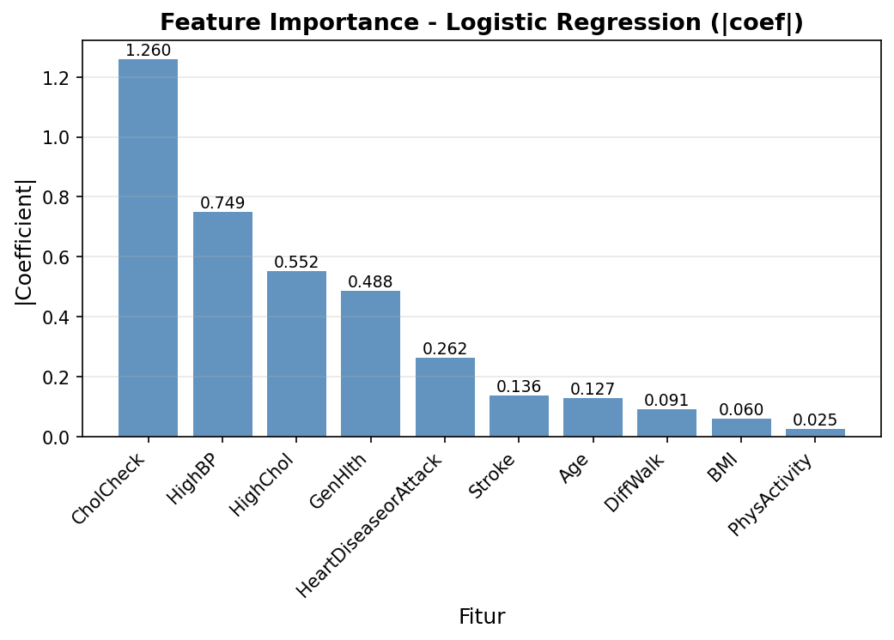

---

### 5. Hyperparameter Tuning

Optimasi menggunakan **RandomizedSearchCV** dengan scoring utama **Recall kelas Diabetes** dan 5-Fold Stratified Cross Validation (30 iterasi).

**Best Parameters:**
```python
{
    'n_estimators'     : 300,
    'min_samples_split': 10,
    'min_samples_leaf' : 4,
    'max_features'     : 'log2',
    'max_depth'        : 10,
    'class_weight'     : {0: 1, 1: 10}
}
```
**Best CV Recall: 0.8849**

---

### 6. Model Evaluation

#### Confusion Matrix Tuned Model
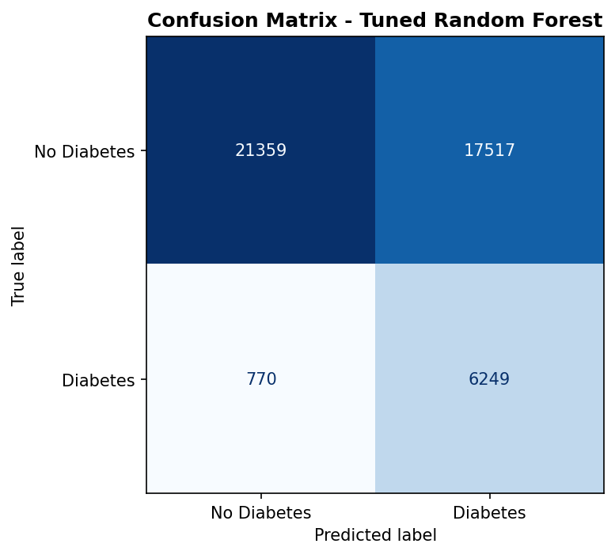

Dari **7.019 kasus Diabetes sejati**, model berhasil mendeteksi **6.249 kasus (TP)** dan hanya melewatkan **770 kasus (FN)**.

#### ROC Curve Tuned Model
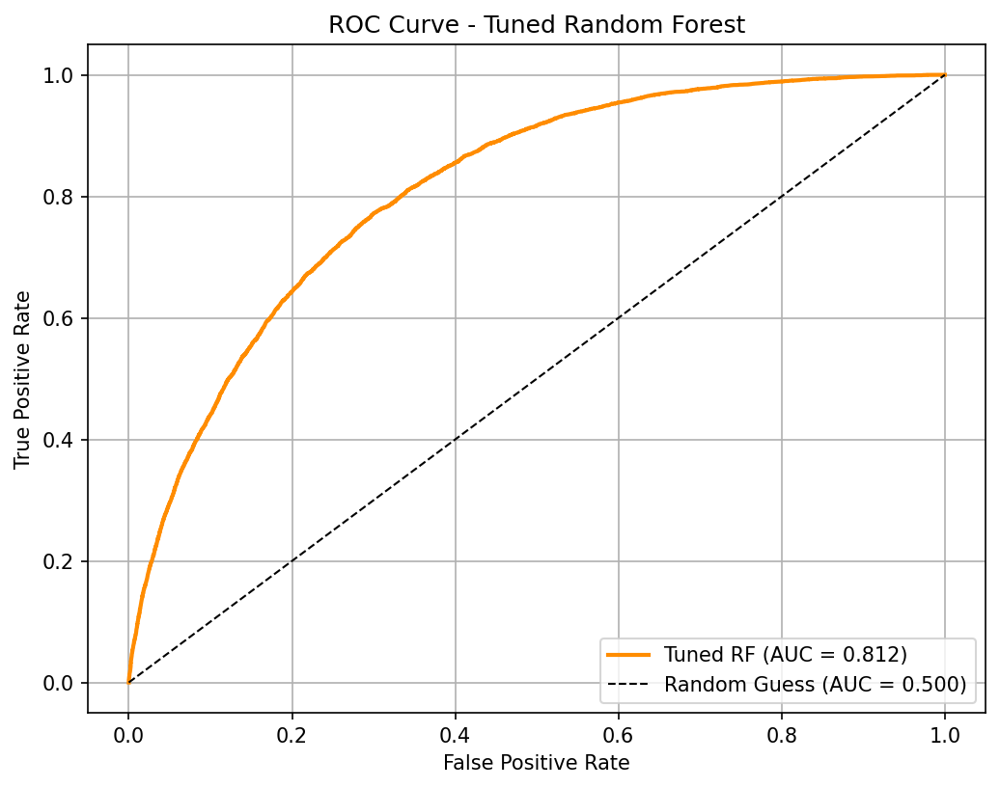

---

### 7. Base Model vs Optimized Model

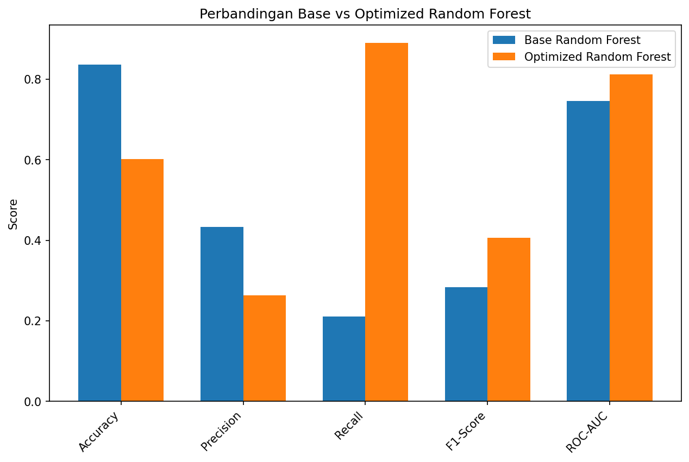

| Metric | Base Random Forest | Optimized Random Forest | Delta |
|---|---|---|---|
| Accuracy | 0.8371 | 0.6015 | -0.2356 |
| Precision | 0.4330 | 0.2629 | -0.1701 |
| **Recall** | 0.2111 | **0.8903** | **+0.6792** ✅ |
| F1-Score | 0.2839 | 0.4060 | +0.1221 |
| ROC-AUC | 0.7466 | **0.8121** | **+0.0655** ✅ |

> Penurunan Accuracy dari 0.8371 → 0.6015 merupakan konsekuensi yang disengaja. Pada data imbalanced 85:15, model yang mengutamakan Accuracy rentan mengalami **accuracy paradox**. Peningkatan Recall dari 0.21 → 0.89 jauh lebih krusial dalam konteks skrining kesehatan karena **False Negative** (penderita diabetes yang tidak terdeteksi) memiliki dampak klinis yang berbahaya.

---

### 8. Cross Validation Results (5-Fold)

| Fold | ROC-AUC | Recall |
|---|---|---|
| Fold 1 | 0.8089 | 0.8873 |
| Fold 2 | 0.8074 | 0.8837 |
| Fold 3 | 0.8036 | 0.8782 |
| Fold 4 | 0.8112 | 0.8882 |
| Fold 5 | 0.8068 | 0.8841 |
| **Mean** | **0.8076** | **0.8843** |
| **Std** | **0.0025** | **0.0035** |

Standar deviasi sangat kecil mengkonfirmasi model **stabil dan tidak overfitting**.

---

### 9. Threshold
Model final menggunakan **default threshold 0.5** karena menghasilkan Recall tertinggi (0.8903) dibandingkan hasil threshold tuning manapun.

---

## Deployment (Flask Web Application)

Model final di-deploy sebagai aplikasi web interaktif menggunakan **Flask**. Pengguna mengisi 18 pertanyaan kesehatan dan gaya hidup, sistem memproses input menggunakan model Random Forest dan menampilkan:

- Probabilitas risiko diabetes dalam persentase
- Level risiko: **Rendah** (< 30%) / **Sedang** (30-50%) / **Tinggi** (> 50%)
- Saran kesehatan yang dipersonalisasi

---

## Technology Stack
| Category | Technology |
|---|---|
| Language | Python 3.x |
| ML Library | Scikit-Learn 1.6.1 |
| Data Processing | Pandas, NumPy |
| Visualization | Matplotlib, Seaborn |
| Model Persistence | Joblib |
| Web Framework | Flask |
| Frontend | HTML, CSS, JavaScript |
| Notebook | Google Colab |
| Version Control | GitHub |

---

## Installation & Running

### Clone Repository
```bash
git clone https://github.com/wardaini/Diabetes-Risk-Prediction.git
cd diabetes_prediction_system/flask
```

### Install Dependencies
```bash
pip install -r requirements.txt
```

### Run Flask Application
```bash
python app.py
```

### Access Application
```bash
http://localhost:5000
```

---

## Key Achievements
- Recall kelas Diabetes meningkat dari **0.21 → 0.89** (+0.68) ✅
- ROC-AUC meningkat dari **0.7466 → 0.8121** (+0.0655) ✅
- Cross Validation Mean Recall **0.8843** (Std: 0.0035) — model stabil
- Berhasil mendeteksi **6.249 dari 7.019** kasus diabetes sejati
- Sistem skrining berbasis web tanpa pemeriksaan laboratorium klinis

---

## Author
**Nur Maya**
NIM: 2307066004
Matematika — Universitas Mulawarman

Program: Magang Mandiri Batch 4 (MSIB) — PT Vinix Seven Aurum
Divisi: Python Machine Learning
Periode: 23 Februari 2026 – 23 Juni 2026
GitHub Repo: https://github.com/nurmay2123-sudo/deteksi-deabetes
